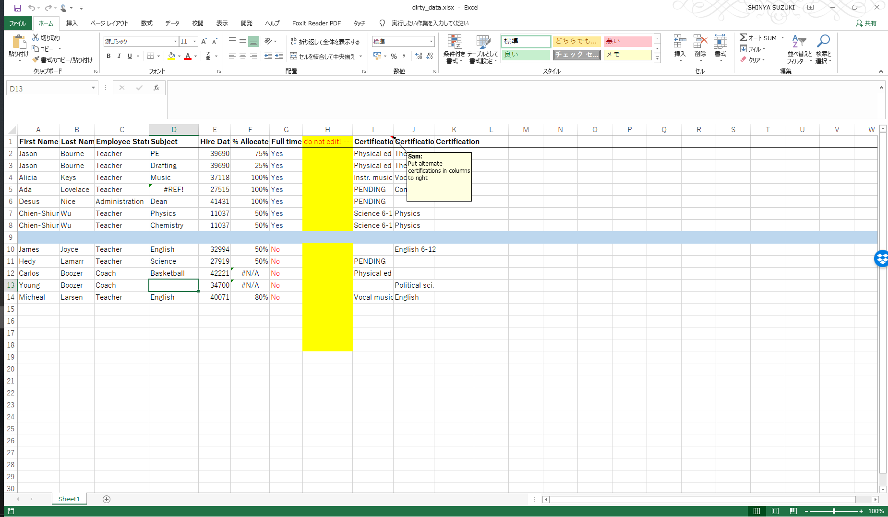

update`r Sys.time()`


```{r setup, message=FALSE, include = FALSE}
config <- yaml::read_yaml("config.yaml")
for (p in config$LIBS$CRAN) {
  if (!require(p, character.only = TRUE)) {
    install.packages(p)
  }
  require(p, character.only = TRUE)
}
```


# はじめに

パッケージ**janitor**はデータの整形に
有用な処理関数郡のパッケージである．
特別な関数があるわけでないが，簡単にかつ楽しく
データの整形ができることが売り．

- [github](https://github.com/sfirke/janitor)


> janitor has simple functions for examining and cleaning dirty data. It was built with beginning and intermediate R users in mind and is optimized for user-friendliness. Advanced R users can already do everything covered here, but with janitor they can do it faster and save their thinking for the fun stuff.


# チュートリアル


## Cleaning dirty data

次のような汚いエクセルデータの整形を考える. 

- ひどい列名
- 値がない行や列
- シリアル番号の日付
- 注意書きのための列



```{r message=FALSE, warning=FALSE}
library(pacman) # for loading packges
p_load(readxl, janitor, dplyr, here)

roster_raw <- 
    "data/dirty_data.xlsx" %>% 
    read_excel()

glimpse(roster_raw)
```


`janitor`パッケージを利用してデータの整形を行う.

```{r}

roster <- 
    roster_raw %>% 
    clean_names() %>% 
    remove_empty(c("rows", "cols")) %>% 
    mutate(
        hire_date = excel_numeric_to_date(hire_date), 
        cert = coalesce(certification_9, certification_10)
    ) %>% 
    select(-starts_with("certification"))

roster
```


## Examining dirty data

### Finding duplicates

重複を発見する. 

```{r}
roster %>% 
    get_dupes(first_name, last_name)
```


### Tabulating tools

1~3変数を集計するためのツール. 
返値はdata.frameであり， 
`adorn_`系の関数を使うことでその解析や見せ方の調整が行える. 
`adorn_`系の関数はテーブル以外に大丈夫. 


```{r}
roster %>% 
    tabyl(subject)
```

```{r}
roster %>% 
    filter(hire_date > as.Date("1950-01-01")) %>% 
    tabyl(employee_status, full_time)
```

```{r}
roster %>% 
    tabyl(
        full_time, 
        subject,
        employee_status, 
        show_missing_levels = FALSE)
```


```{r}
roster %>% 
    tabyl(employee_status, full_time) %>% 
    adorn_totals("row") %>% 
    adorn_percentages("row") %>% 
    adorn_pct_formatting() %>% 
    adorn_ns() %>% 
    adorn_title("combined")
```


### objects

```{r}
objects("package:janitor") %>% 
    cat(sep = "\n")
```


